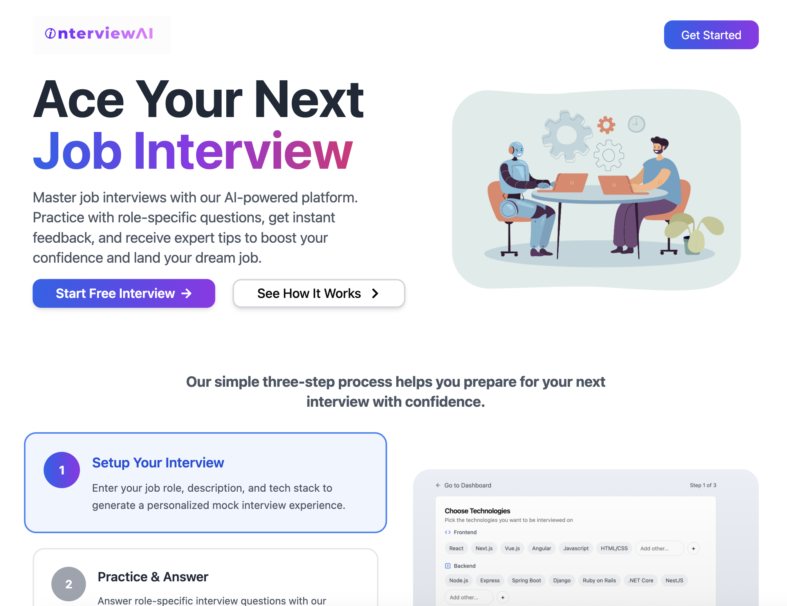
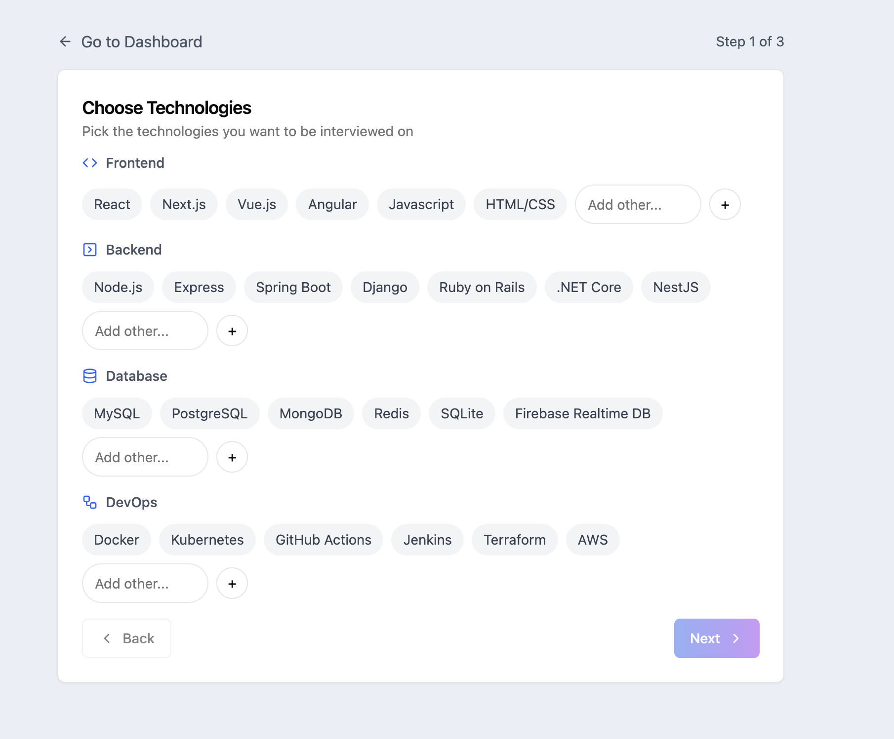
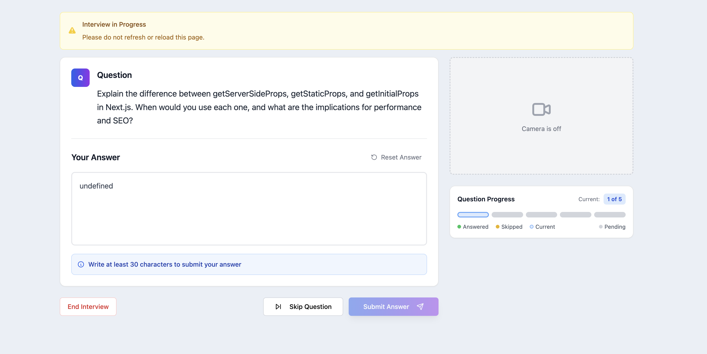
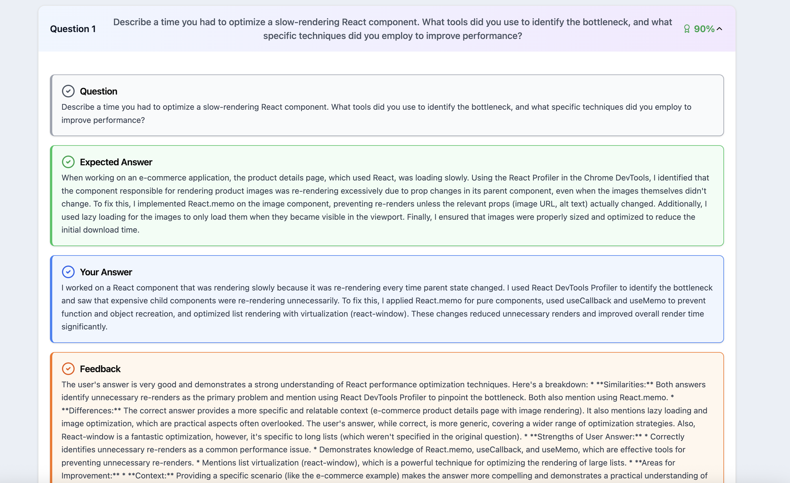
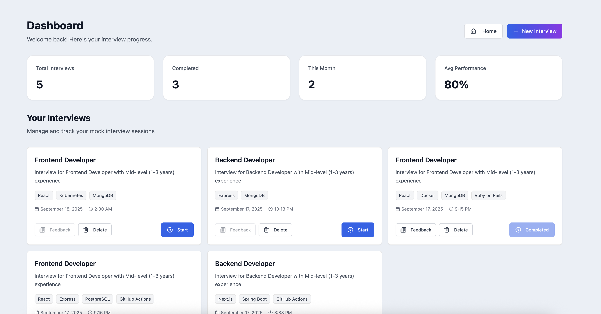
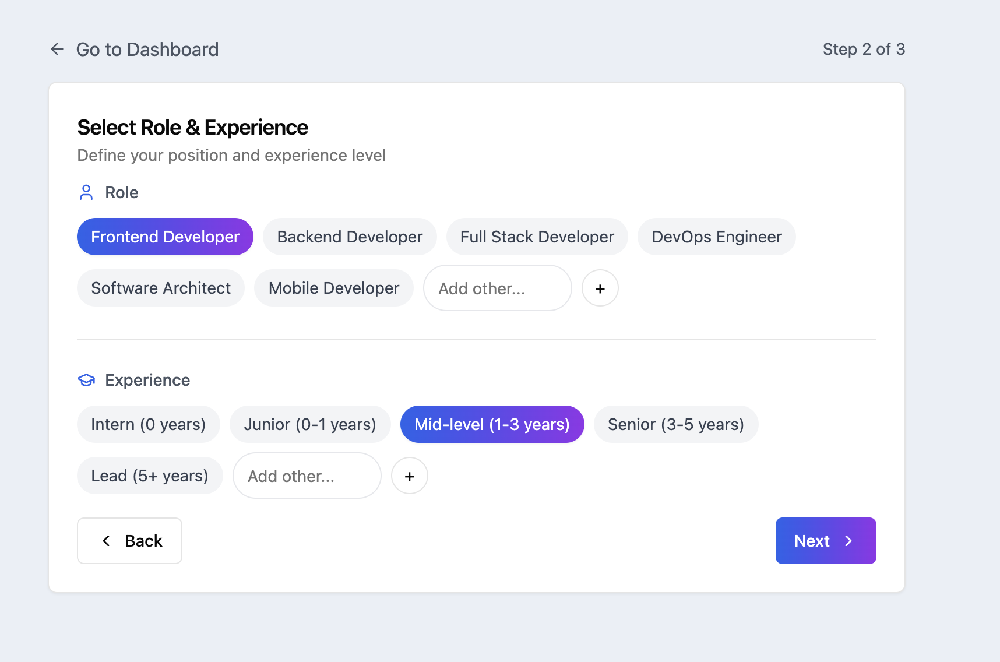
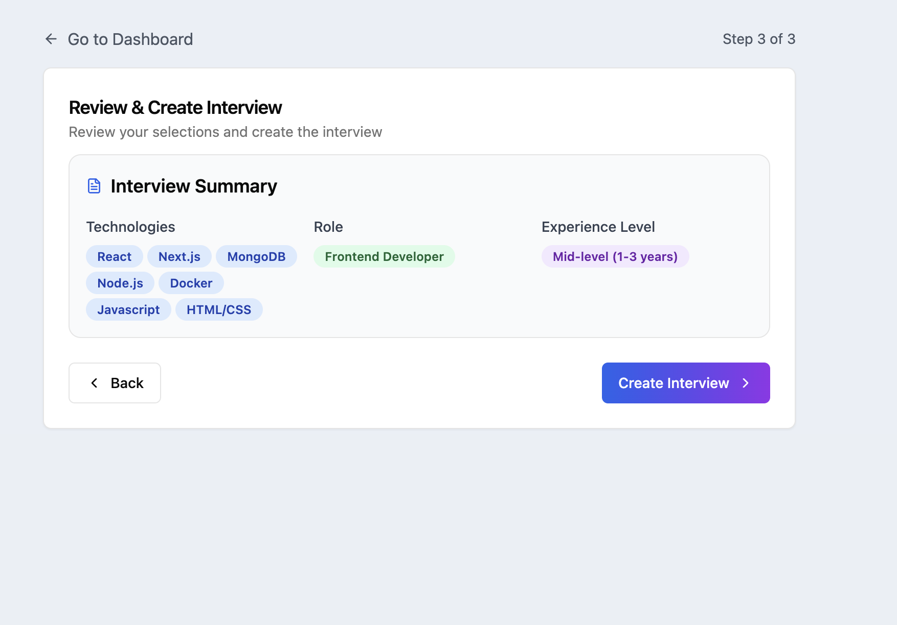

# 🎯 InterviewAI - AI-Powered Interview Preparation Platform

> **Transform your interview preparation with intelligent AI feedback and personalized mock interviews**

[](https://reactjs.org/)
[](https://www.typescriptlang.org/)
[](https://firebase.google.com/)
[](https://ai.google.dev/)
[](https://tailwindcss.com/)

## 🚀 Overview

InterviewAI is a comprehensive interview preparation platform that leverages cutting-edge AI technology to provide personalized mock interviews, real-time feedback, and detailed performance analytics. Built with modern web technologies, it offers an immersive interview experience with webcam integration and speech recognition.

<div align="center">
  
  <p><em>Modern, responsive homepage with gradient design and clear call-to-action</em></p>
</div>

## ✨ Key Features

### **AI-Powered Mock Interviews**
- **Dynamic Question Generation**: Uses Google Gemini 2.0 to generate role-specific technical questions
- **Real-time Feedback**: Instant AI analysis of answers with detailed scoring and improvement suggestions
- **Personalized Experience**: Customized interviews based on tech stack, role, and experience level

<div align="center">
  
  <p><em>Multi-step interview setup with tech stack and role selection</em></p>
</div>

### **Immersive Interview Experience**
- **Webcam Integration**: Live video recording during interviews for realistic practice
- **Speech Recognition**: Voice-to-text functionality for natural answer input
- **Media Permissions**: Secure camera and microphone access management

<div align="center">
  
  <p><em>Interactive interview interface with live webcam and question display</em></p>
</div>

### **Comprehensive Analytics**
- **Performance Tracking**: Detailed scoring system with individual question ratings
- **Overall Feedback**: AI-generated strengths, improvements, and performance summary
- **Progress Dashboard**: Track interview history and improvement over time

<div align="center">
  
  <p><em>Detailed performance analytics with AI-generated feedback and scoring</em></p>
</div>

### **Secure & Scalable**
- **Firebase Authentication**: Secure user management and data protection
- **Real-time Database**: Cloud Firestore for instant data synchronization
- **Responsive Design**: Optimized for desktop and mobile devices

<div align="center">
  
  <p><em>Clean dashboard interface for managing interviews and tracking progress</em></p>
</div>

## 🛠️ Technology Stack

### **Frontend**
- **React 19** - Latest React with concurrent features
- **TypeScript** - Type-safe development
- **Tailwind CSS** - Utility-first styling
- **Radix UI** - Accessible component primitives
- **React Router** - Client-side routing

### **Backend & Services**
- **Firebase** - Authentication, Firestore database, hosting
- **Google Gemini 2.0** - AI question generation and feedback
- **Vite** - Fast build tool and development server

### **Media & AI**
- **React Webcam** - Camera integration
- **Speech Recognition** - Voice input processing
- **Google Generative AI** - Advanced AI capabilities

## 🏗️ Architecture Highlights

### **Smart AI Integration**
```typescript
// Dynamic question generation based on user preferences
const generateAiResponse = async ({ techStacks, role, experience }) => {
  const prompt = `Generate 5 technical interview questions for ${role} 
  with ${experience} experience in ${techStacks.join(", ")}`;
  
  const aiResult = await chatSession.sendMessage(prompt);
  return cleanAiResponse(aiResult.response.text());
};
```

### **Real-time Feedback System**
- **Question-level Analysis**: Individual scoring and feedback for each answer
- **Overall Performance**: Comprehensive evaluation with strengths and improvements
- **Smart Prompting**: Context-aware AI prompts for accurate assessment

### **Component Architecture**
- **Modular Design**: Reusable components with clear separation of concerns
- **Context Management**: React Context for state management across components
- **Protected Routes**: Secure navigation with authentication guards

## 🎯 Key Challenges Overcome

### **1. AI Response Parsing & Validation**
**Challenge**: Ensuring consistent JSON responses from AI with proper error handling
**Solution**: Implemented robust parsing utilities with fallback mechanisms and type validation

### **2. Real-time Media Integration**
**Challenge**: Managing camera/microphone permissions across different browsers
**Solution**: Created comprehensive permission management system with user-friendly fallbacks

### **3. Dynamic Question Generation**
**Challenge**: Generating relevant, role-specific questions with varying complexity
**Solution**: Developed sophisticated prompting system with context-aware AI integration

### **4. Performance Optimization**
**Challenge**: Handling large datasets and real-time updates efficiently
**Solution**: Implemented optimized Firebase queries and React performance patterns

### **5. User Experience Design**
**Challenge**: Creating intuitive interview flow with clear progress indication
**Solution**: Built step-by-step wizard with visual feedback and progress tracking

## 🚀 Getting Started

### Prerequisites
- Node.js 18+ 
- Firebase project with Firestore enabled
- Google AI API key

### Installation

```bash
# Clone the repository
git clone https://github.com/yourusername/InterviewAI.git
cd InterviewAI

# Install dependencies
npm install

# Set up environment variables
cp .env.example .env.local
# Add your Firebase and Google AI credentials

# Start development server
npm run dev
```

### Environment Variables
```env
VITE_FIREBASE_API_KEY=your_firebase_api_key
VITE_FIREBASE_AUTH_DOMAIN=your_project.firebaseapp.com
VITE_FIREBASE_PROJECT_ID=your_project_id
VITE_GEMINI_API_KEY=your_gemini_api_key
```

## 📱 Usage

1. **Sign Up/Login** - Create account with Firebase authentication
2. **Setup Interview** - Select tech stack, role, and experience level
3. **Configure Media** - Grant camera and microphone permissions
4. **Practice Interview** - Answer AI-generated questions with real-time feedback
5. **Review Results** - Analyze performance with detailed feedback and suggestions

### 🎯 **Interview Setup Process**

<div align="center">
  
  
  <p><em>Step-by-step interview configuration with intuitive category selection</em></p>
</div>

## 🎨 UI/UX Features

- **Modern Design**: Clean, professional interface with gradient accents
- **Responsive Layout**: Optimized for all device sizes
- **Accessibility**: WCAG compliant with keyboard navigation
- **Loading States**: Smooth transitions and progress indicators
- **Error Handling**: User-friendly error messages and recovery options

## 🔧 Development

```bash
# Development
npm run dev

# Build for production
npm run build

# Linting
npm run lint

# Preview production build
npm run preview
```

---

**Built with ❤️ by Vaishnavi Rastogi** - *Empowering developers to ace their interviews*